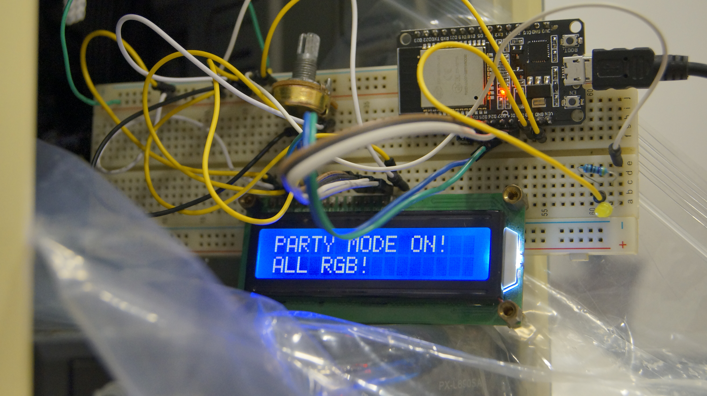
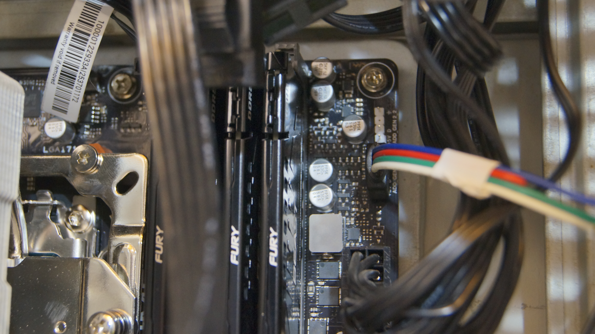

# ASUS AURA — LED-контроллер и LCD-дисплей

Управление ARGB LED-контроллером ASUS AURA (0b05:19af) через USB-HID.
Включает **CLI утилиту**, **MCP сервер** для OpenCode/Claude, и **ESP32-скетч** для декодирования сигнала WS2812B.

## Фотографии

### Общий вид макета


Плата ESP32 DevKit с подключённым HD44780 LCD (16×2) через 4-битный параллельный
интерфейс. Сигнальный провод от GPIO16 подключён к линии данных ARGB-контроллера
ASUS AURA для захвата WS2812B-кадра.

### Разъём ARGB


3-контактный разъём ARGB (5V, Data, GND) для подключения к материнской плате
или AURA-контроллеру. По этой линии ESP32 принимает WS2812B-сигнал через RMT.

### Схема подключения


Полная схема соединений ESP32 DevKit с HD44780 LCD, индикаторными LED и ARGB-лентой.

## Быстрый старт

```bash
# Сборка (требуется Go 1.25+)
make

# Поиск устройства
./aura-indicator/bin/aura-ctl detect

# Индикатор
./aura-indicator/bin/aura-ctl set led2 static 0,0,255   # синий
./aura-indicator/bin/aura-ctl blink 255,0,0 5 200       # мигает красным
./aura-indicator/bin/aura-ctl off led2                  # выключить

# LCD дисплей (16x2, только ASCII, ≤32 символа)
./aura-indicator/bin/aura-ctl lcd "Hello, World!"

# Независимые строки (≤16 символов каждая)
./aura-indicator/bin/aura-ctl lcd-line 0 "Top line"
./aura-indicator/bin/aura-ctl lcd-line 1 "Bottom line"
```

## Примеры

Забавные скрипты для демонстрации — в каталоге `examples/`:

| Скрипт | Описание |
|--------|----------|
| `demo-full.sh` | Full-screen тексты: Hello World, LCD go brrrr |
| `demo-lines.sh` | Независимые строки, мигание индикатора |
| `demo-leds.sh` | 6 цветов LED + LCD не затирается |
| `demo-matrix.sh` | Отсылки к фильму «Матрица» |
| `demo-moods.sh` | Цвет индикатора под настроение |
| `demo-quotes.sh` | Знаменитые цитаты на дисплее |
| `demo-game.sh` | Игровая сцена: загрузка → бой → победа |
| `demo-rainbow.sh` | Радуга на индикаторе |
| `demo-status.sh` | Имитация прогресса (как в MCP) |

```bash
cd examples && ./demo-rainbow.sh
```

Все тексты только ASCII, ≤16 символов на строку, ≤32 full-screen.

## Сборка

```bash
make          # aura-ctl + aura-indicator → aura-indicator/bin/
make cross    # кросс-компиляция под Linux/Win/Mac (amd64 + arm64)
make clean    # удалить bin/
```

## Структура проекта

```
aura/
├── aura-indicator/         # Go-проект (CLI + MCP сервер)
│   ├── cmd/
│   │   ├── aura-ctl/       # CLI: detect, status, set, direct, lcd, blink
│   │   └── aura-indicator/ # MCP сервер (JSON-RPC stdin/stdout)
│   ├── pkg/aura/           # Go-библиотека: HID-протокол, LCD, состояние
│   ├── bin/                # Собранные бинарники
│   └── go.mod
├── aura_rmt/               # ESP32 Arduino скетч (aura_rmt.ino)
├── examples/               # Демо-скрипты
├── docs/                   # Техническая документация (PROTOCOL.md)
├── assets/                 # 3D-модели корпуса LCD (FreeCAD, STL, 3MF)
├── img/                    # Фотографии макета
├── Makefile                # Сборка проектов
└── README.md
```

## LCD (16x2 символьный дисплей через LED-ленту)

LED-лента на канале **led2** используется одновременно как индикатор (LED0)
и как 16×2 символьный дисплей (LED1..LED32, по 3 символа на LED).

**Важно:**
- Только ASCII 0x20–0x7F. Русские буквы/эмодзи → пробел.
- Индикатор (LED0) и LCD (LED1..LED32) работают **независимо**:
  `set led2 static RED` меняет только LED0, LCD-текст сохраняется.
- Строки обновляются независимо: `lcd-line 0` не затирает строку 1.

**Мэппинг:**

| Позиция 0–31 | LED (`pos/3` +1) | Канал (`pos%3`) |
|-------------|------------------|-----------------|
| 0, 1, 2     | LED1             | R, G, B         |
| 3, 4, 5     | LED2             | R, G, B         |
| …           | …                | …               |
| 30, 31      | LED11            | R, G (B свободен) |

## 3D-печатный корпус для LCD

В каталоге `assets/` находятся модели для 3D-печати корпуса LCD-дисплея:

| Файл | Описание |
|------|----------|
| `LCD.FCStd` | Исходный проект в FreeCAD |
| `LCD-Body.stl` | 3D-модель для печати (STL) |
| `LCD-Body.3mf` | 3D-модель в формате 3MF |

## Команды CLI (aura-ctl)

| Команда | Аргументы | Описание |
|---------|-----------|----------|
| `detect` | — | Найти AURA-устройства |
| `status` | — | Статус: каналы, прошивка, конфиг |
| `set` | `<канал> <режим> [RGB]` | Режим: static, rainbow, breathing, off… |
| `direct` | `<канал> <RGB>...` | Прямые цвета на LED |
| `off` | `<канал>` | Выключить (для led2 — только индикатор) |
| `lcd` | `<текст>` | Full-screen, до 32 символов |
| `lcd-line` | `<строка> <текст>` | Одна строка (0 или 1), до 16 символов |
| `blink` | `<RGB> [раз] [мс]` | Мигание индикатором |

Глобальный флаг: `-d /dev/hidrawN` — путь к устройству (по умолчанию автоопределение).

### Примеры

```bash
# Эффекты
aura-ctl set led2 static 255,0,0
aura-ctl set led2 rainbow
aura-ctl set led2 breathing 0,0,255
aura-ctl off led2

# LCD
aura-ctl lcd "Hello from Go!"
aura-ctl lcd-line 0 "First line"
aura-ctl lcd-line 1 "Second line"

# Мигание
aura-ctl blink 255,0,0 5 150
```

## MCP сервер (aura-indicator)

JSON-RPC сервер по протоколу MCP (Model Context Protocol).
Используется OpenCode/Claude для управления индикатором и LCD.

Запускается агентами автоматически. Поддерживаемые инструменты:

| Инструмент | Назначение |
|-----------|-----------|
| `aura_notify_start` | Синий — задача начата |
| `aura_notify_done` | Зелёный — задача выполнена |
| `aura_notify_off` | Выключить индикатор |
| `aura_notify_question` | Красный — ожидание ответа |
| `aura_notify_importance` | Яркость синего (0–100%) |
| `aura_notify_progress` | Прогресс (0–100%) |
| `aura_lcd_print` | Текст на дисплей |
| `aura_blink` | Мигание индикатором |

## ESP32 firmware (aura_rmt/)

Скетч `aura_rmt/aura_rmt.ino`:
- **RX:** RMT-периферия на GPIO16 захватывает ARGB-сигнал
- **Декодер:** LED0 декодируется (GRB), красный → GPIO13, зелёный → GPIO12, синий → GPIO2 (PWM)
- **Serial:** `l` — live/histogram, `d` — дамп кадра, `t` — self-test

## USB-HID протокол

Контроллер — HID-устройство с 65-байтовыми пакетами (префикс `0xEC`).
Протокол совместим с OpenRGB (AuraMainboardController).

### Effect (режим)
```
0xEC 0x35 [channel_type] 0x00 0x00 [mode]
```
### Color (цвет с маской)
```
0xEC 0x36 [mask_hi] [mask_lo] 0x00 [R] [G] [B]
```
### Direct (по-LED)
```
0xEC 0x40 [channel|0x80] [start_LED] [count] [R G B...]
```
### Commit
```
0xEC 0x3F 0x55
```

## Установка (udev)

```bash
echo 'SUBSYSTEM=="hidraw", ATTRS{idVendor}=="0b05", MODE="0666"' | \
  sudo tee /etc/udev/rules.d/99-aura.rules
sudo udevadm trigger
```

## Ссылки

- `docs/PROTOCOL.md` — полная спецификация WS2812B (тайминги, структура кадра)
